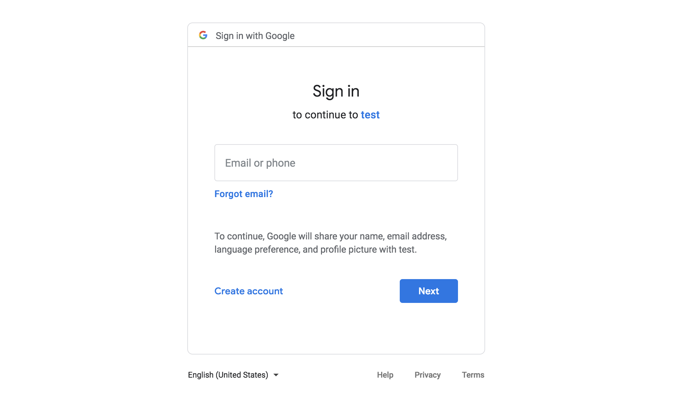

In this guide we will see how to authenticate users with your application by allowing them to log in to their Google 
account. This guide is just an example to get you started and does not cover all aspects of a complete setup, 
like setting up a domain and SSL certificates.

## Setup
First, we need to install Gloo Mesh Enterprise (minimum version `1.1`) with extauth enabled. Please refer to the corresponding
[installation guide]() for details.

This guide makes use of the Bookinfo sample application. You can install the application by following the steps in the [Bookinfo deployment section]({}).

#### Creating a Virtual Gateway
Now let's configure Gloo Mesh Gateway to route requests to the destination we just created. To do that, we define a simple Virtual
Gateway to match all requests that:

- contain a `Host` header with value `www.example.com` and
- have a path that starts with `/ratings`



Let's send a request that matches the above route to the Gloo Mesh gateway and make sure it works:

```shell
curl -v $(BOOKINFO_INGRESS_GATEWAY_URL)/ratings/1 -H "Host: www.example.com"
```

The above command should return:

```json
{"id":1,"ratings":{"Reviewer1":5,"Reviewer2":4}}
```

## Securing the Virtual Gateway
As we just saw, we were able to reach our application without having to provide any credentials. This is because by default Gloo Mesh allows any request on routes that do not specify authentication configuration. Let's change this behavior. We will update the Virtual Gateway so that each request to the sample application is authenticated using an **OpenID Connect** flow.

### Register your application with Google
In order to use Google as our identity provider, we need to register our application with the Google API.
To do so:

- Log in to the [Google Developer Console](https://console.developers.google.com/)
- If this is the first time using the console, create a [project](https://cloud.google.com/resource-manager/docs/creating-managing-projects)
as prompted;
- Navigate to the [OAuth consent screen](https://console.developers.google.com/apis/credentials/consent) menu item
- Input a name for your application in the *Application name* text field and select **Internal** as the *Application type*
- Click **Save**;
- Navigate to the [Credentials](https://console.developers.google.com/apis/credentials) menu item
- click **Create credentials**, and then **OAuth client ID**
- On the next page, select *Web Application* as the type of the client (as we are only going to use it for demonstration purposes), 
- Enter a name for the OAuth client ID or accept the default value
- Under *Authorized redirect URIs* click on **Add URI**
- Enter the URI: `http://localhost:8080/callback`
- Click **Create**

You will be presented with the **client id** and **client secret** for your application.
Let's store them in two environment variables:

```noop
CLIENT_ID=<your client id>
CLIENT_SECRET=<your client secret>
```

### Create a client ID secret
Gloo Mesh expects the client secret to stored in a Kubernetes secret. Let's create the secret with the value of our `CLIENT_SECRET` variable:

```shell
BASE64_CLIENT_SECRET=$(echo -n $CLIENT_SECRET | base64)
kubectl apply -f - <<EOF
apiVersion: v1
kind: Secret
metadata:
  name: google
  namespace: bookinfo
type: extauth.solo.io/oauth
data:
  client-secret: $BASE64_CLIENT_SECRET
EOF
```

### Create an AuthConfig

Now let's create the `AuthConfig` resource that we will use to secure our Virtual Gateway.

```shell
kubectl apply -f - <<EOF
apiVersion: enterprise.gloo.solo.io/v1
kind: AuthConfig
metadata:
  name: google-oidc
  namespace: bookinfo
spec:
  configs:
  - oauth2:
      oidcAuthorizationCode:
        appUrl: http://localhost:8080
        callbackPath: /callback
        clientId: $CLIENT_ID
        clientSecretRef:
          name: google
          namespace: bookinfo
        issuerUrl: https://accounts.google.com
        session:
          cookieOptions:
            notSecure: true
        scopes:
        - email
EOF
```

{}
The above configuration uses the new `oauth2` syntax. The older `oauth` syntax is still supported, but has been deprecated.
Note this example explicitly allows insecure cookies (`session.cookieOptions.notSecure`), so that it works in this guide using localhost. In a live hosted environment secured with TLS, you should not set this.
{}

Notice how we set the `CLIENT_ID` and reference the client secret we just created. The `callback_path` matches the authorized redirect URI we added for the OAuth Client ID. Redirecting to an unauthorized URI would result in an error from the Google authentication flow.

#### Update the Virtual Gateway
Once the `AuthConfig` containing the LDAP configuration has been created, we can use it to secure our Virtual Gateway
by applying the following:



{}
This example is sending the `/callback` prefix to `/ratings/2`, a path that exists but will be malformed. The request will be interpreted by the ratings service, but you could easily add code for a `/login` path instead of `/ratings/2` that would parse the state information from Google and use it to load a profile of the user.
{}

## Testing our configuration
Since we didn't register an external URL, Google will only allow authentication with applications running on localhost for security reasons. We can make the Gloo Mesh proxy available on localhost using `kubectl port-forward`:

```shell
kubectl port-forward -n istio-system deploy/istio-ingressgateway-ns 8080 &
portForwardPid=$! # Store the port-forward pid so we can kill the process later
```

Now if you open your browser and go to [http://localhost:8080/ratings/1](http://localhost:8080/ratings/1) you should be redirected to the Google login screen:


 
If you provide your Google credentials, Gloo Mesh should redirect you to the `/callback` page, with the information from Google added as a query string.


If this does not work, one thing to check is the `requestTimeout` setting on your `extauth` Settings. See the warning in the [setup section](#setup) for more details.

### Logging

The ext-auth-service logs can be viewed with:
```
kubectl logs -n gloo-mesh deploy/ext-auth-service -c ext-auth-service -f
```
If the auth config has been received successfully, you should see the log line:
```
"logger":"extauth","caller":"runner/run.go:179","msg":"got new config"
```

## Cleanup
To clean up the resources we created during this tutorial you can run the following commands:

```bash
kill $portForwardPid
kubectl delete vg -n bookinfo test-inlined-gateway
kubectl delete authconfig -n bookinfo google-oidc
kubectl delete secret -n bookinfo google
```
